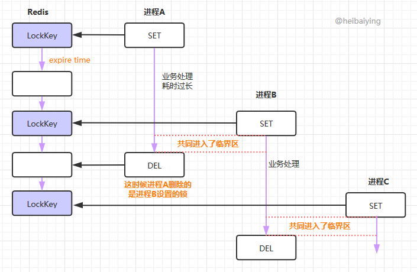
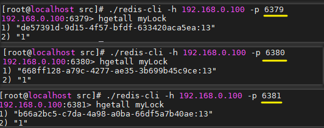

# Redis 分布式锁

## 一、实现原理

### 1.1 基本原理

JDK 原生的锁可以让不同**线程**之间以互斥的方式来访问共享资源，但如果想要在不同**进程**之间以互斥的方式来访问共享资源，JDK 原生的锁就无能为力。此时可以使用 Redis 或 Zookeeper 来实现分布式锁。

Redis 实现分布式锁的核心命令如下：

```shell
SETNX key value
```

SETNX 命令的作用是如果指定的 key 不存在，则创建并将为其设置值，此时返回状态码为 1，否则为 0。如果状态码为 1，代表获得该锁；此时其他进程再次尝试创建时，都回返回 0 ，代表锁已经被占用。当获得锁的进程处理完成业务后，再通过 `del` 命令将该 key 删除，其他进程就可以再次竞争性地进行创建，获得该锁。

通常为了避免死锁，我们会为锁设置一个超时时间，在 Redis 中可以通过 `expire` 命令来进行实现：

```shell
EXPIRE key seconds
```

这里我们将两者结合起来，并使用 Jedis 客户端来进行实现，其代码如下：

```java
Long result = jedis.setnx("lockKey", "lockValue");
if (result == 1) {
	// 如果此处程序被异常终止（如直接kill -9进程），则设置超时的操作就无法进行，该锁就会出现死锁
	jedis.expire("lockKey", 3);
}
```

上面的代码存在原子性问题，即 setnx + expire 操作是非原子性的，如果在设置超时时间前，程序被异常终止，则程序就会出现死锁。此时可以将 SETNX 和 EXPIRE 两个命令写在同一个 Lua 脚本中，然后通过调用 Jedis 的 `eval()` 方法来执行，并由 Redis 来保证整个 Lua 脚本操作的原子性。这种方式实现比较繁琐，因此官方文档中推荐了另外一种更加优雅的实现方法：

### 1.2 官方推荐

[官方文档]( Distributed locks with Redis) 中推荐直接使用 set 命令来进行实现：

```shell
SET key value [EX seconds|PX milliseconds] [NX|XX] [KEEPTTL]
```

这里我们主要关注以下四个参数：

- **EX** ：设置超时时间，单位是秒；
- **PX** ：设置超时时间，单位是毫秒；
- **NX** ：当且仅当对应的 Key 不存在时候才进行设置；
- **XX**：当且仅当对应的 Key 不存在时候才进行设置。

这四个参数从 Redis 2.6.12 版本开始支持，因为当前大多数在用的 Redis 都已经高于这个版本，所以推荐直接使用该命令来实现分布式锁。对应的 Jedis 代码如下：

```java
jedis.set("lockKey", "lockValue", SetParams.setParams().nx().ex(3));
```

此时一条命令就可以完成值和超时时间的设置，并且因为只有一条命令，因此其原子性也得到了保证。但因为引入了超时时间来避免死锁，同时也存在了两个其他问题：



+ **问题一**：当业务处理的时间超过过期时间后，由于锁已经被释放，此时其他进程就可以获得该锁，这意味着同时有两个进程进入了临界区，此时分布式锁就失效了；
+ **问题二**：如上图所示，当进程 A 业务处理完成后，此时删除的是进程 B 的锁，进而导致分布式锁又一次失效，进程 B 和 进程 C 同时进入了临界区。

针对问题二，我们可以在创建锁时为其指定一个唯一的标识作为 Key 的 Value，这里假设我们采用 `UUID + 线程ID` 来作为唯一标识：

```java
String identifier = UUID.randomUUID() + ":" + Thread.currentThread().getId();
jedis.set("LockKey", identifier, SetParams.setParams().nx().ex(3));
```

然后在删除锁前，先将该唯一标识与锁的 Value 值进行比较，如果不相等，证明该锁不属于当前的操作对象，此时不执行删除操作。为保证判断操作和删除操作整体的原子性，这里需要使用 Lua 脚本来执行：

```shell
if redis.call("get",KEYS[1]) == ARGV[1] then
    return redis.call("del",KEYS[1])
else
    return 0
end
```

这段脚本的意思是如果 value 的值与给定的值相同，则执行删除命令，否则直接返回状态码 0 。对应使用 Jedis 实现的代码如下：

```java
String script = "if redis.call('get', KEYS[1]) == ARGV[1] then return redis.call('del', KEYS[1]) else return 0 end";
jedis.eval(script, 
           Collections.singletonList("LockKey"),  // keys的集合
           Collections.singletonList(identifier)  // args的集合
          );
```

接着再看问题一，问题一最简单的解决方法是：你可以估计业务的最大处理时间，然后保证设置的过期时间大于最大处理时间。但是由于业务需要面临各种复杂的情况，因此可能无法保证业务每一次都能在规定的过期时间内处理完成，此时可以使用延长锁时效的策略。

### 1.3  延长锁时效

延长锁时效的方案如下：假设锁超时时间是 30 秒，此时程序需要每隔一段时间去扫描一下该锁是否还存在，扫描时间需要小于超时时间，通常可以设置为超时时间的 1/3，在这里也就是 10 秒扫描一次。如果锁还存在，则重置其超时时间恢复到 30 秒。通过这种方案，只要业务还没有处理完成，锁就会一直有效；而当业务一旦处理完成，程序也会马上删除该锁。

Redis 的 Java 客户端 Redisson 提供的分布式锁就支持延长锁时效的机制，称为 WatchDog，直译过来就是 “看门狗” 机制。

以上讨论的都是单机环境下的 Redis 分布式锁，而想要保证 Redis 分布式锁是高可用，首先 Redis 得是高可用的，Redis 的高可用模式主要有两种：哨兵模式和集群模式。


## 二、哨兵模式与分布式锁

哨兵模式是主从模式的升级版，能够在故障发生时自动进行故障切换，选举出新的主节点。但由于 Redis 的复制机制是异步的，因此在哨兵模式下实现的分布式锁是不可靠的，原因如下：

+ 由于主从之间的复制操作是异步的，当主节点上创建好锁后，此时从节点上的锁可能尚未创建。而如果此时主节点发生了宕机，从节点上将不会创建该分布式锁；
+ 从节点晋升为主节点后，其他进程（或线程）仍然可以在该新主节点创建分布式锁，此时就存在多个进程（或线程）同时进入了临界区，分布式锁就失效了。

因此在哨兵模式下，无法避免锁失效的问题。因此想要实现高可用的分布式锁，可以采取 Redis 的另一个高可用方案 —— Redis 集群模式。


## 三、集群模式与分布式锁

### 3.1 RedLock 方案

想要在集群模式下实现分布式锁，Redis 提供了一种称为 RedLock 的方案，假设我们有 N 个 Redis 实例，此时客户端的执行过程如下：

+ 以毫秒为单位记录当前的时间，作为开始时间；
+ 接着采用和单机版相同的方式，依次尝试在每个实例上创建锁。为了避免客户端长时间与某个故障的 Redis 节点通讯而导致阻塞，这里采用快速轮询的方式：假设创建锁时设置的超时时间为 10 秒，则访问每个 Redis 实例的超时时间可能在 5 到 50 毫秒之间，如果在这个时间内还没有建立通信，则尝试下一个实例；
+ 如果在至少 N/2+1 个实例上都成功创建了锁。并且 `当前时间 - 开始时间 < 锁的超时时间` ，则认为已经获取了锁，锁的有效时间等于 `超时时间 - 花费时间`（如果考虑到不同 Redis 实例所在的服务器存在时钟漂移，则还需要减去时钟漂移）；
+ 如果少于 N/2+1 个实例，则认为创建分布式锁失败，此时需要删除这些实例上已创建的锁，以便其他客户端进行创建。
+ 该客户端在失败后，可以等待一个随机的时间后，再次进行重试。

以上就是 RedLock 的实现方案，可以看到主要是由客户端来实现的，并不真正涉及到 Redis 集群相关的功能。因此这里的 N 个 Redis 实例并不要求是一个真正的 Redis 集群，它们彼此之间可以是完全独立的，但由于只需要半数节点获得锁就能真正获得锁，因此对于分布式锁功能而言，其仍然是高可用的。后面使用 Redisson 来演示 RedLock 时会再次验证这一点。


### 3.2 低延迟通讯和多路复用

实现 RedLock 方案的客户端与所有 Redis 实例进行通讯时，必须要保证低延迟，而且最好能使用多路复用技术来保证一次性将 SET 命令发送到所有 Redis 节点上，并获取到对应的执行结果。假设网络延迟高，此时客户端 A 和 B 分别尝试创建锁：

```shell
SET key 随机数A EX 3 NX  #A客户端
SET key 随机数B EX 3 NX  #B客户端
```

假设客户端 A 在一半节点上创建了锁，而客户端 B 在另外一半节点上创建了锁，此时两个客户端都无法获取到锁。如果并发很高，则可能存在多个客户端分别在部分节点上创建了锁，而没有一个客户端的数量超过 N/2+1。这也就是上面过程的最后一步中，强调一旦客户端失败后，需要等待一个随机时间后再进行重试的原因，如果是一个固定时间，则所有失败的客户端又同时发起重试，情况就还是一样。

因此最佳的实现就是客户端的 SET 命令能几乎同时到达所有节点，并几乎同时接受到所有执行结果。 想要保证这一点，低延迟的网络通信极为关键，下文介绍的 Redisson 就采用 Netty 来实现了这一功能。


### 3.3 持久化与高可用

为了保证高可用，所有 Redis 节点都需要开启持久化。假设不开启持久化，假设进程 A 获得锁后正在处理业务逻辑，此时节点宕机重启，因为锁数据丢失了，其他进程便可以再次获得该锁，因此所有 Redis 节点都需要开启 AOF 持久化方式。

AOF 默认的同步机制为 `everysec`，即每秒进程一次持久化，此时能够兼顾性能与数据安全，发生意外宕机的时，最多会丢失一秒的数据。但如果碰巧就是在这一秒的时间内进程 A 创建了锁，此时其他进程也可以获得该锁，锁的互斥性也就失效了。要解决这个问题有两种方式：

+ **方式一**：修改 Redis.conf 中 `appendfsync` 的值为 always，即每次命令后都进行持久化，此时降低了 Redis 性能，进而也会降低了分布式锁的性能，但锁的互斥性得到了绝对的保证；
+ **方式二**：一旦节点宕机了，等到锁的超时时间过了之后才进行重启，此时相当于原有锁自然失效（你需要保证业务在自己设定的超时时间内能完成），这种方案称为延时重启。


## 四、Redisson

Redisson 是 Redis 的 Java 客户端，它提供了各种的 Redis 分布式锁的实现，如可重入锁、公平锁、RedLock、读写锁等等，并且在实现上考虑得也更加全面，适用于生产环境下使用。

### 4.1 分布式锁

使用 Redisson 来创建单机版本分布式锁非常简单，示例如下：

```java
// 1.创建RedissonClient,如果与spring集成，可以将RedissonClient声明为Bean,在使用时注入即可
Config config = new Config();
config.useSingleServer().setAddress("redis://192.168.0.100:6379");
RedissonClient redissonClient = Redisson.create(config);

// 2.创建锁实例
RLock lock = redissonClient.getLock("myLock");
try {
	//3.尝试获取分布式锁，第一个参数为等待时间，第二个参数为锁过期时间
	boolean isLock = lock.tryLock(10, 30, TimeUnit.SECONDS);
	if (isLock) {
		// 4.模拟业务处理
        System.out.println("处理业务逻辑");
		Thread.sleep(20 * 1000);
	}
} catch (Exception e) {
	e.printStackTrace();
} finally {
	//5.释放锁
	lock.unlock();
}
redissonClient.shutdown();
```

此时对应在 Redis 中的数据结构如下：


可以看到 key 就是代码中设置的锁名，而 value 值的类型是 hash，其中键 `9280e909-c86b-43ec-b11d-6e5a7745e2e9:13`  的格式为 `UUID + 线程ID`，键对应的值为 1，代表加锁的次数。之所以要采用 hash 这种格式，主要是因为 Redisson 创建的锁是具有重入性的，即你可以多次进行加锁：

```java
boolean isLock1 = lock.tryLock(0, 30, TimeUnit.SECONDS);
boolean isLock2 = lock.tryLock(0, 30, TimeUnit.SECONDS);
```

此时对应的值就会变成 2，代表加了两次锁：


当然和其他重入锁一样，需要保证加锁的次数和解锁的次数一样，才能完全解锁：

```java
lock.unlock();
lock.unlock();
```


### 4.2 RedLock

Redisson 也实现了 Redis 官方推荐的 RedLock 方案，这里我们启动三个 Redis 实例进行演示，它们彼此之间可以是完全独立的，并不需要进行集群的相关配置：

```shell
$ ./redis-server ../redis.conf
$ ./redis-server ../redis.conf --port 6380
$ ./redis-server ../redis.conf --port 6381
```

对应的代码示例如下：

```java
// 1.创建RedissonClient
Config config01 = new Config();
config01.useSingleServer().setAddress("redis://192.168.0.100:6379");
RedissonClient redissonClient01 = Redisson.create(config01);
Config config02 = new Config();
config02.useSingleServer().setAddress("redis://192.168.0.100:6380");
RedissonClient redissonClient02 = Redisson.create(config02);
Config config03 = new Config();
config03.useSingleServer().setAddress("redis://192.168.0.100:6381");
RedissonClient redissonClient03 = Redisson.create(config03);

// 2.创建锁实例
String lockName = "myLock";
RLock lock01 = redissonClient01.getLock(lockName);
RLock lock02 = redissonClient02.getLock(lockName);
RLock lock03 = redissonClient03.getLock(lockName);

// 3. 创建 RedissonRedLock
RedissonRedLock redLock = new RedissonRedLock(lock01, lock02, lock03);

try {
	boolean isLock = redLock.tryLock(10, 300, TimeUnit.SECONDS);
	if (isLock) {
		// 4.模拟业务处理
		System.out.println("处理业务逻辑");
		Thread.sleep(200 * 1000);
	}
} catch (Exception e) {
	e.printStackTrace();
} finally {
	//5.释放锁
	redLock.unlock();
}

redissonClient01.shutdown();
redissonClient02.shutdown();
redissonClient03.shutdown();
```

此时每个 Redis 实例上锁的情况如下：



可以看到每个实例上都获得了锁。

### 4.3 延长锁时效

最后，介绍一下 Redisson 的 WatchDog 机制，它可以用来延长锁时效，示例如下：

```java
Config config = new Config();
// 1.设置WatchdogTimeout
config.setLockWatchdogTimeout(30 * 1000);
config.useSingleServer().setAddress("redis://192.168.0.100:6379");
RedissonClient redissonClient = Redisson.create(config);

// 2.创建锁实例
RLock lock = redissonClient.getLock("myLock");
try {
	//3.尝试获取分布式锁，第一个参数为等待时间
	boolean isLock = lock.tryLock(0, TimeUnit.SECONDS);
	if (isLock) {
		// 4.模拟业务处理
		System.out.println("处理业务逻辑");
		Thread.sleep(60 * 1000);
		System.out.println("锁剩余的生存时间：" + lock.remainTimeToLive());
	}
} catch (Exception e) {
	e.printStackTrace();
} finally {
	//5.释放锁
	lock.unlock();
}
redissonClient.shutdown();
```

这里我们通过 `config.setLockWatchdogTimeout(30 * 1000)` 将 lockWatchdogTimeout 的值设置为 30000 毫秒（默认值也是 30000 毫秒）。lockWatchdogTimeout 只会对那些没有设置锁超时时间的锁生效，所以我们这里调用的是两个参数的 `tryLock()` 方法：

```java
boolean tryLock(long time, TimeUnit unit) throws InterruptedException;
```

而不是包含超时时间的三个参数的 `tryLock()` 方法：

```java
boolean tryLock(long waitTime, long leaseTime, TimeUnit unit) throws InterruptedException;
```

Redisson 的 WatchDog 机制会以 lockWatchdogTimeout 的 1/3 时长为周期（在这里就是 10 秒）对所有未设置超时时间的锁进行检查，如果业务尚未处理完成（也就是锁还没有被程序主动删除），Redisson 就会将锁的超时时间重置为 lockWatchdogTimeout 指定的值（在这里就是设置的 30 秒），直到锁被程序主动删除。因此在上面的例子中可以看到，不论将模拟业务的睡眠时间设置为多长，其锁都会存在一定的剩余生存时间，直至业务处理完成。

反之，如果明确的指定了锁的超时时间 leaseTime，则以 leaseTime 的时间为准，WatchDog 机制对明确指定超时时间的锁不会生效。


## 参考资料

+ [Distributed locks with Redis](https://redis.io/topics/distlock)
+ [Redisson Distributed locks and synchronizers](https://github.com/redisson/redisson/wiki/8.-distributed-locks-and-synchronizers)